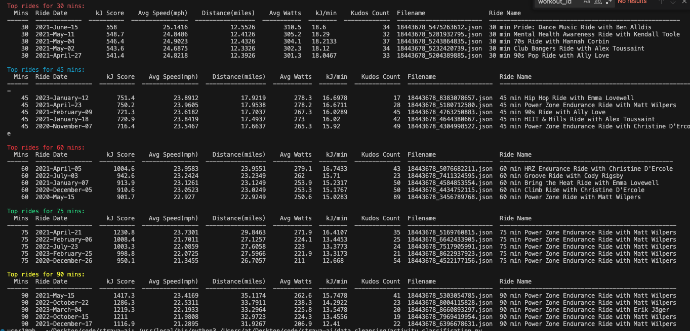
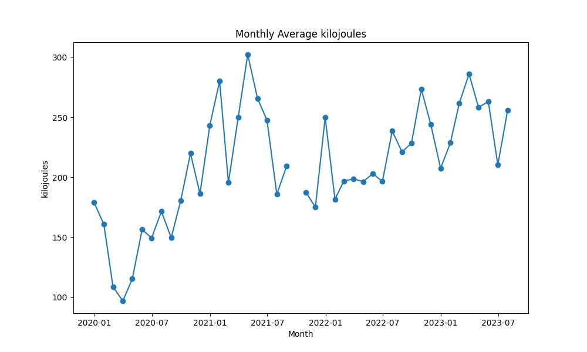
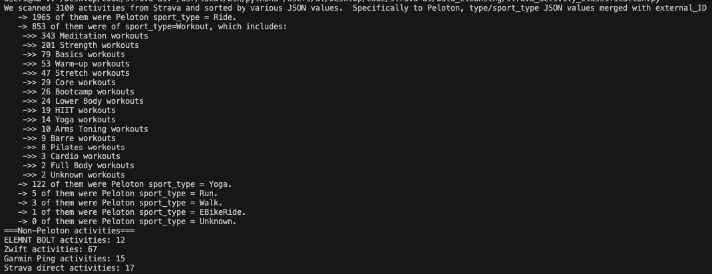
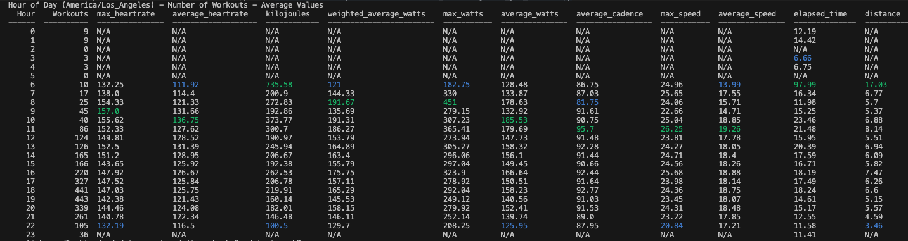

# Strava Workout Analyzer

This is a suite of Python scripts for the Strava fitness application. The aim is to download, cleanse and analyze user activities in different ways. There are scripts to access the Strava API, fetch and refresh access tokens, download activities, validate JSON data and classify, score and provide summary statistics about activities.

### List and value of some scripts:
1. **validate_json.py**: 
This script takes JSON files containing cycling activities and validates those files. It counts the occurrences of each field, checks for missing fields and prints a summary report.
   
2. **initialize.py**: 
This script initializes the process of fetching a new token from the Strava API, checking for existing tokens and validating them. It also logs the token checking process for future reference.
   
3. **last_n_activities.py**: 
It downloads the last few activities from Strava, and stores each activity as a separate JSON file. The script checks for duplicates and only saves new activities to the directory.
   
4. **monthly_totals_over_time.py**: 
It scans the downloaded activities, categorizes them by the activity type and provides a summary count of them in the corresponding folder.
   
5. **top_peloton_rides.py**: 
This script finds the top 5 Peloton rides in your Strava history based on a scoring system that measures effort exerted during the ride.
   
6. **strava_activity_classification.py**: 
This script classifies Peloton activities and contains logic to track sub-types of more generic categories, such as "Workout". It also classifies other platforms like ELEMNT BOLT, Zwift, Garmin Ping, Strava Direct, and others.

7. **briskr_score.py**: 
This script is used to rank and score rides based on the amount of effort spent using Bris.kr score method. It provides a summary of the top 5 rides for each length of ride.

8. **monthly_totals_over_time.py**: 
This script scans the downloaded activities, categorizes them by the activity type and month, and provides a summary count of activities for each month. 

## Setup
1. Clone this repository to your local system.
2. Create a `.env` file in the same directory.
3. Inside `.env`, add your Strava Client ID and Client Secret as follows:

```sh
STRAVA_CLIENT_ID=your_client_id
STRAVA_CLIENT_SECRET=your_client_secret
```

Replace `your_client_id` and `your_client_secret` with your actual Client ID and Client Secret.

### Python Libraries Used:
This project makes use of following Python libraries:
- json
- os
- glob
- collections
- csv
- requests
- datetime
- dotenv
- pytz
- pandas
- colorama
- tabulate
- re

### Instructions to Run most of it:
1. Make sure that you have Python 3 installed on your machine.
2. Install the necessary Python dependencies as mentioned in the "Python Libraries Used" section above with pip using command `pip install <library_name>`.
3. Add your project directory to your PYTHONPATH environment variable.
4. Run the required script with the command `python <filename.py>`.

### Future Scope:
Hit me up with ideas, but a few things: 
- Add a graphical interface for better user interaction.
- More refined activity categorization based on user input.
- Addition of a weather interaction module to adjust the score based on weather conditions.
- Introduce more metrics to evaluate the performance of users.

## Limit Rate
Strava API has a limit of 100 requests per 15 minutes and 1000 requests per day. If the limit is exceeded, be friendly to their API!

# Screenshots




